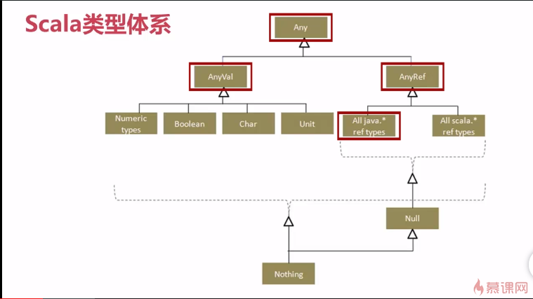

*Scala的特性*
1. 可伸缩（Scalable）
2. 纯正的面向对象语言
3. 函数式语言
4. 无缝的Java互操作
    
*三种变量修饰符*
1. val定义immutable variable
2. var定义mutable variable
3. lazy val 被调用时才会被计算，用来定义可能不会被调用的变量

*数据类型*



*初学Scala时可以查看Predef对象的源码，它提供了许多具有Scala编程特性的好例子*


*函数是第一等公民，Scala语言支持*：
1. 把函数作为实参传递给另外一个函数
2. 把函数作为返回值
3. 把函数赋值给变量
4. 把函数存储在数据结构里

*匿名函数*
1. 定义：val y = (x: Int) => x + 1
2. 调用： y(10) 或 y.apply(10)

*柯理化*
    柯理化函数(Curried Function) 把具有多个参数的函数转换为一条函数链，每个节点上是单一参数。

*class、object和case class、case object*
1. scala不能定义静态成员，所以用定义的单例对象代之（object）
2. 单例对象不能带参数，类可以
3. 对象可以和类名一样，此时object被称为半生对象，class被称为伴生类，半生类和对象可以互相访问其私有属性，但前提是它们必须在一个源文件中。
4. 类只会被编译，不会被执行
5. case class被称为样例类，常用语模式匹配
6. case class初始化时可以不用new，也可以加上（普通类必须加上new）
7. case class 默认实现了eaquals hashCode toString copy等方法，并是可以序列化的（实现了Serializable）
8. case class 构造函数参数是public的，可以直接访问,默认情况下不能修改属性值
9. case class最重要的功能是支持模式匹配
10. 类中有参和无参，当类有参数的时候，用case class，当类没有参数的时候那么用case object

*辅助构造函数*
1. 辅助构造函数必须用this命名创建
2. 每个辅助构造函数必须从调用之前定义的构造函数开始
3. 每个构造函数必须有不同的签名
4. 一个构造函数通过this调用另一个不同的构造函数

*伴生对象*
伴生对象就是定义在与类的同一个文件中，同时对象与类有相同的名字
伴生对象有很多用途，其中之一就是在伴生对象中的任意一个方法将会编程该对象的静态方法
    
*要实现不用new实例化对象的方法*
1. case class不用new
2. 伴生对象
    
*方法作用域*
1. 对象私有(Object-private)作用域:最严格的访问限制是把方法标记为对象私有，这样的方法只在当前对象的实例可见，同一个类的其它实例对象也无法调用此方法。
```scala
private[this] def isFoo = true
```
2. 私有作用域：私有方法的限制会稍少一些，一个私有方法对当前实例和当前类的其它实例可见
这和Java中的方法作用域相同，将上面例子中的private[this]改成private即可
3. 保护作用域：标记为protected的方法对子类可见
4. 包作用域：为了使一个方法对包内所有成员可见，可使用private[packageName]将方法标记为对当前包私有
5. 公开作用域：如果方法声明上没有访问修饰符，方法就是公开级别的。

*隐式转换*
我们需要某个类中的一个方法，但是这个类没有提供这样的方法，所以我们需要隐式转化，转换成提供了这个方法的类，然后再通过这个类调用这个方法
1. 需要一个增强的类，提供我们想要的方法，接收的参数类型一定要是被增强类的类型
2. 需要在单例对象中写明隐式转换
3. 导入隐式转换函数
隐式转换的思中常见使用场景：
1. 将某一类型转换成预期类型
2. 类型增强和扩展
3. 模拟新的语法
4. 类型类

     